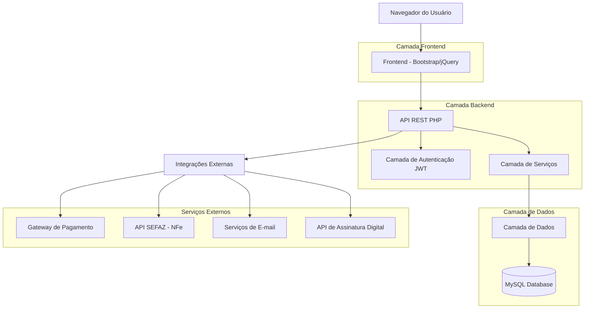
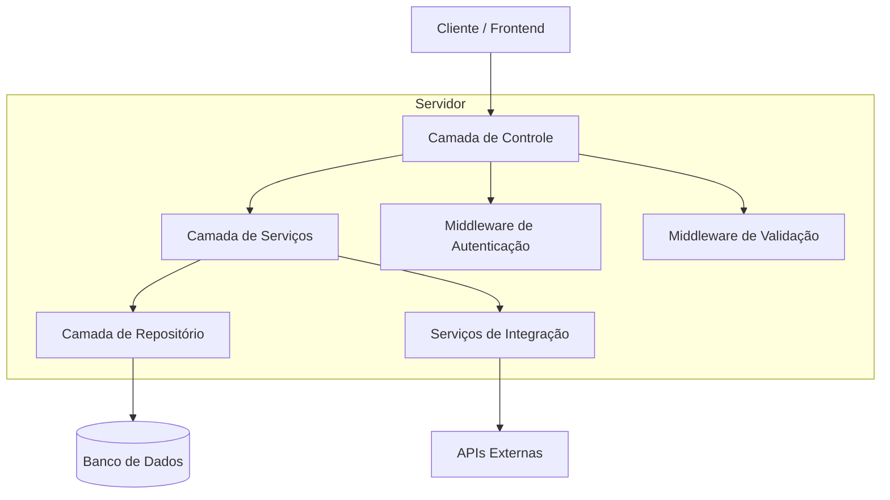
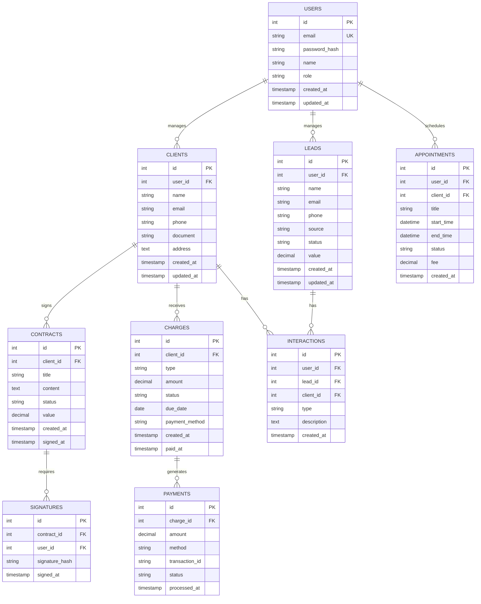

# Sistema CRM Empresarial - Arquitetura Técnica

## 1. Design da Arquitetura



## 2. Descrição das Tecnologias

* **Frontend**: HTML5 + CSS3 + jQuery\@3.6 + Bootstrap\@5.3

* **Backend**: PHP\@8.2 + Slim Framework\@4 (API REST)

* **Banco de Dados**: MySQL\@8.0

* **Autenticação**: JWT (JSON Web Tokens)

* **Servidor Web**: Apache/Nginx

* **Dependências PHP**: Composer para gerenciamento

## 3. Definições de Rotas

| Rota                  | Propósito                                              |
| --------------------- | ------------------------------------------------------ |
| /dashboard            | Página principal com métricas e visão geral do sistema |
| /login                | Página de autenticação de usuários                     |
| /crm/leads            | Gestão de leads e oportunidades de vendas              |
| /crm/clients          | Cadastro e gestão de clientes                          |
| /crm/pipeline         | Visualização do funil de vendas                        |
| /crm/tasks            | Controle de tarefas e lembretes                        |
| /scheduling           | Sistema de agendamento de reuniões                     |
| /scheduling/calendar  | Visualização de calendário integrado                   |
| /billing              | Gestão de cobranças e pagamentos                       |
| /billing/invoices     | Emissão e controle de notas fiscais                    |
| /contracts            | Criação e gestão de contratos digitais                 |
| /contracts/signatures | Controle de assinaturas eletrônicas                    |
| /reports              | Relatórios e dashboards analíticos                     |
| /settings             | Configurações do sistema e perfil do usuário           |

## 4. Definições de API

### 4.1 APIs Principais

**Autenticação de usuários**

```
POST /api/auth/login
```

Request:

| Nome do Parâmetro | Tipo   | Obrigatório | Descrição         |
| ----------------- | ------ | ----------- | ----------------- |
| email             | string | true        | E-mail do usuário |
| password          | string | true        | Senha do usuário  |

Response:

| Nome do Parâmetro | Tipo    | Descrição                    |
| ----------------- | ------- | ---------------------------- |
| success           | boolean | Status da autenticação       |
| token             | string  | Token JWT para sessão        |
| user              | object  | Dados do usuário autenticado |

Exemplo:

```json
{
  "email": "usuario@empresa.com",
  "password": "senha123"
}
```

**Gestão de Leads**

```
GET /api/crm/leads
POST /api/crm/leads
PUT /api/crm/leads/{id}
DELETE /api/crm/leads/{id}
```

**Agendamentos**

```
GET /api/scheduling/appointments
POST /api/scheduling/appointments
PUT /api/scheduling/appointments/{id}
```

**Cobranças**

```
GET /api/billing/charges
POST /api/billing/charges
POST /api/billing/payment-link
```

**Contratos**

```
GET /api/contracts
POST /api/contracts
POST /api/contracts/{id}/sign
```

## 5. Diagrama da Arquitetura do Servidor



## 6. Modelo de Dados

### 6.1 Definição do Modelo de Dados



### 6.2 Linguagem de Definição de Dados

**Tabela de Usuários (users)**

```sql
-- Criar tabela
CREATE TABLE users (
    id INT AUTO_INCREMENT PRIMARY KEY,
    email VARCHAR(255) UNIQUE NOT NULL,
    password_hash VARCHAR(255) NOT NULL,
    name VARCHAR(100) NOT NULL,
    role ENUM('admin', 'seller', 'financial', 'basic') DEFAULT 'basic',
    created_at TIMESTAMP DEFAULT CURRENT_TIMESTAMP,
    updated_at TIMESTAMP DEFAULT CURRENT_TIMESTAMP ON UPDATE CURRENT_TIMESTAMP
);

-- Criar índices
CREATE INDEX idx_users_email ON users(email);
CREATE INDEX idx_users_role ON users(role);
```

**Tabela de Leads (leads)**

```sql
CREATE TABLE leads (
    id INT AUTO_INCREMENT PRIMARY KEY,
    user_id INT NOT NULL,
    name VARCHAR(100) NOT NULL,
    email VARCHAR(255),
    phone VARCHAR(20),
    source VARCHAR(50),
    status ENUM('new', 'contacted', 'qualified', 'proposal', 'won', 'lost') DEFAULT 'new',
    value DECIMAL(10,2) DEFAULT 0,
    created_at TIMESTAMP DEFAULT CURRENT_TIMESTAMP,
    updated_at TIMESTAMP DEFAULT CURRENT_TIMESTAMP ON UPDATE CURRENT_TIMESTAMP,
    INDEX idx_leads_user_id (user_id),
    INDEX idx_leads_status (status),
    INDEX idx_leads_created_at (created_at DESC)
);
```

**Tabela de Clientes (clients)**

```sql
CREATE TABLE clients (
    id INT AUTO_INCREMENT PRIMARY KEY,
    user_id INT NOT NULL,
    name VARCHAR(100) NOT NULL,
    email VARCHAR(255),
    phone VARCHAR(20),
    document VARCHAR(20),
    address TEXT,
    created_at TIMESTAMP DEFAULT CURRENT_TIMESTAMP,
    updated_at TIMESTAMP DEFAULT CURRENT_TIMESTAMP ON UPDATE CURRENT_TIMESTAMP,
    INDEX idx_clients_user_id (user_id),
    INDEX idx_clients_email (email)
);
```

**Tabela de Agendamentos (appointments)**

```sql
CREATE TABLE appointments (
    id INT AUTO_INCREMENT PRIMARY KEY,
    user_id INT NOT NULL,
    client_id INT,
    title VARCHAR(200) NOT NULL,
    start_time DATETIME NOT NULL,
    end_time DATETIME NOT NULL,
    status ENUM('scheduled', 'confirmed', 'completed', 'cancelled') DEFAULT 'scheduled',
    fee DECIMAL(8,2) DEFAULT 0,
    created_at TIMESTAMP DEFAULT CURRENT_TIMESTAMP,
    INDEX idx_appointments_user_id (user_id),
    INDEX idx_appointments_start_time (start_time),
    INDEX idx_appointments_status (status)
);
```

**Tabela de Contratos (contracts)**

```sql
CREATE TABLE contracts (
    id INT AUTO_INCREMENT PRIMARY KEY,
    client_id INT NOT NULL,
    title VARCHAR(200) NOT NULL,
    content LONGTEXT NOT NULL,
    status ENUM('draft', 'sent', 'signed', 'cancelled') DEFAULT 'draft',
    value DECIMAL(12,2) DEFAULT 0,
    created_at TIMESTAMP DEFAULT CURRENT_TIMESTAMP,
    signed_at TIMESTAMP NULL,
    INDEX idx_contracts_client_id (client_id),
    INDEX idx_contracts_status (status)
);
```

**Tabela de Cobranças (charges)**

```sql
CREATE TABLE charges (
    id INT AUTO_INCREMENT PRIMARY KEY,
    client_id INT NOT NULL,
    type ENUM('one_time', 'recurring') DEFAULT 'one_time',
    amount DECIMAL(10,2) NOT NULL,
    status ENUM('pending', 'paid', 'overdue', 'cancelled') DEFAULT 'pending',
    due_date DATE NOT NULL,
    payment_method ENUM('pix', 'credit_card', 'boleto') DEFAULT 'pix',
    created_at TIMESTAMP DEFAULT CURRENT_TIMESTAMP,
    paid_at TIMESTAMP NULL,
    INDEX idx_charges_client_id (client_id),
    INDEX idx_charges_status (status),
    INDEX idx_charges_due_date (due_date)
);
```

**Dados Iniciais**

```sql
-- Usuário administrador padrão
INSERT INTO users (email, password_hash, name, role) VALUES 
('admin@sistema.com', '$2y$10$example_hash', 'Administrador', 'admin');

-- Status padrão para leads
INSERT INTO
```

