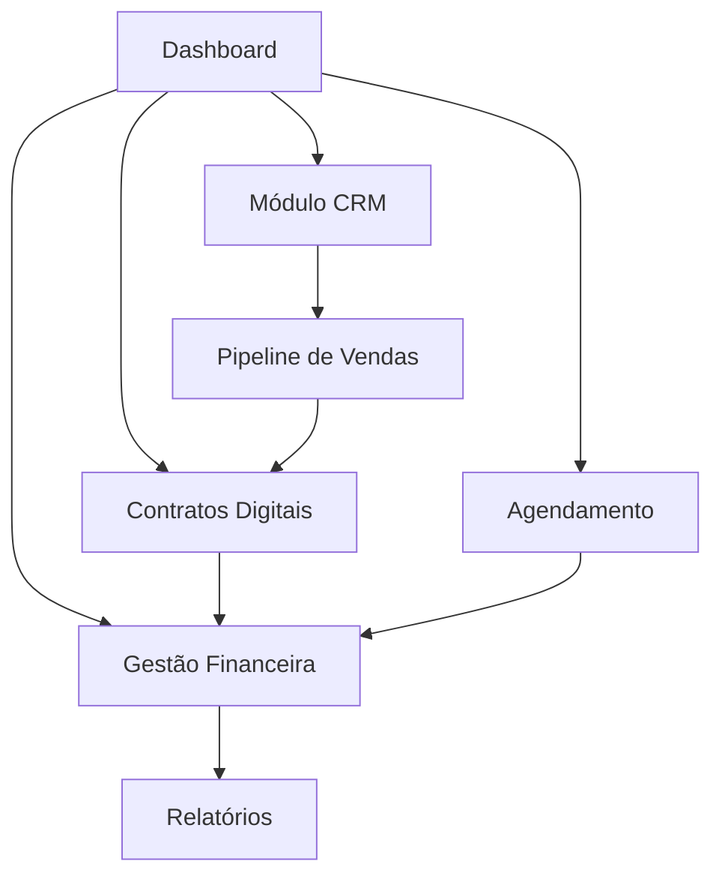

# Sistema CRM Empresarial - Documento de Requisitos

## 1. Visão Geral do Produto

Sistema web completo de CRM empresarial que integra gestão de clientes, agendamentos, cobranças e contratos digitais em uma plataforma unificada.

O sistema resolve a necessidade de empresas gerenciarem todo o ciclo de vendas desde o primeiro contato até a assinatura de contratos, eliminando a necessidade de múltiplas ferramentas e processos manuais.

Objetivo: Aumentar a eficiência operacional e acelerar o ciclo de vendas através de automação e integração de processos.

## 2. Funcionalidades Principais

### 2.1 Papéis de Usuário

| Papel | Método de Registro | Permissões Principais |
|-------|-------------------|----------------------|
| Administrador | Criação manual pelo sistema | Acesso completo a todos os módulos e configurações |
| Vendedor | Convite por administrador | Gestão de leads, clientes, agendamentos e contratos |
| Financeiro | Convite por administrador | Acesso a cobranças, relatórios financeiros e notas fiscais |
| Usuário Básico | Registro por convite | Visualização de dados e interações básicas |

### 2.2 Módulos Funcionais

Nosso sistema CRM é composto pelas seguintes páginas principais:

1. **Dashboard Principal**: painel de controle, métricas de vendas, tarefas pendentes, agenda do dia
2. **Módulo CRM**: gestão de leads, cadastro de clientes, histórico de interações, pipeline de vendas
3. **Agendamento**: calendário integrado, reserva de salas, cobrança de taxas, múltiplas agendas
4. **Gestão Financeira**: emissão de cobranças, links de pagamento, controle de recorrências, notas fiscais
5. **Contratos Digitais**: criação de contratos, assinaturas eletrônicas, templates personalizáveis
6. **Relatórios**: dashboards analíticos, relatórios de vendas, métricas de performance
7. **Configurações**: perfil de usuário, configurações do sistema, integrações
8. **Autenticação**: login, registro, recuperação de senha

### 2.3 Detalhes das Páginas

| Nome da Página | Nome do Módulo | Descrição da Funcionalidade |
|----------------|----------------|-----------------------------|
| Dashboard Principal | Painel de Controle | Exibir métricas em tempo real, tarefas pendentes, agenda do dia, gráficos de performance |
| Dashboard Principal | Navegação Rápida | Acesso direto aos módulos principais, busca global, notificações |
| Módulo CRM | Gestão de Leads | Cadastrar leads, classificar por origem, atribuir responsáveis, acompanhar status |
| Módulo CRM | Cadastro de Clientes | Criar perfis completos, histórico de compras, dados de contato, segmentação |
| Módulo CRM | Pipeline de Vendas | Visualizar funil de vendas, mover oportunidades entre etapas, previsão de fechamento |
| Módulo CRM | Histórico de Interações | Registrar ligações, e-mails, reuniões, anotações personalizadas |
| Módulo CRM | Gestão de Tarefas | Criar tarefas únicas e recorrentes, definir lembretes, acompanhar conclusão |
| Agendamento | Calendário Integrado | Visualizar disponibilidade, agendar reuniões, sincronizar com calendários externos |
| Agendamento | Múltiplas Agendas | Gerenciar agendas por usuário/sala, definir horários disponíveis, bloqueios |
| Agendamento | Sistema de Reservas | Permitir agendamento online, cobrar taxas quando aplicável, confirmações automáticas |
| Gestão Financeira | Emissão de Cobranças | Criar cobranças avulsas e recorrentes, definir vencimentos, aplicar juros |
| Gestão Financeira | Processamento de Pagamentos | Integrar PIX, cartão de crédito, boleto, confirmar pagamentos automaticamente |
| Gestão Financeira | Links de Pagamento | Gerar links personalizados, enviar por e-mail/WhatsApp, rastrear conversões |
| Gestão Financeira | Notas Fiscais | Emitir NFe automaticamente, integrar com SEFAZ, controlar numeração |
| Contratos Digitais | Editor de Contratos | Criar contratos com templates, campos dinâmicos, cláusulas personalizáveis |
| Contratos Digitais | Assinaturas Eletrônicas | Coletar assinaturas digitais válidas juridicamente, certificados digitais |
| Contratos Digitais | Fluxo de Aprovação | Definir sequência de assinaturas, notificações automáticas, controle de status |
| Relatórios | Dashboards Analíticos | Gráficos interativos, métricas de conversão, análise de performance |
| Relatórios | Relatórios Financeiros | Receitas, inadimplência, projeções, exportação para Excel/PDF |
| Configurações | Perfil de Usuário | Editar dados pessoais, alterar senha, preferências de notificação |
| Configurações | Configurações do Sistema | Personalizar campos, definir etapas do pipeline, integrações |
| Autenticação | Login/Registro | Autenticar usuários via JWT, recuperar senhas, validação de e-mail |

## 3. Processo Principal

**Fluxo do Vendedor:**
1. Vendedor faz login no sistema
2. Visualiza dashboard com leads e tarefas pendentes
3. Cadastra novo lead ou atualiza lead existente
4. Agenda reunião com o cliente
5. Registra interações e move lead no pipeline
6. Cria proposta e gera contrato digital
7. Envia contrato para assinatura eletrônica
8. Após assinatura, emite cobrança
9. Acompanha pagamento e emite nota fiscal

**Fluxo do Cliente:**
1. Cliente agenda reunião online
2. Recebe confirmação e lembretes automáticos
3. Participa da reunião
4. Recebe proposta por e-mail
5. Assina contrato digitalmente
6. Recebe link de pagamento
7. Efetua pagamento
8. Recebe nota fiscal automaticamente

## 4. Design da Interface do Usuário

### 4.1 Estilo de Design

- **Cores Primárias**: Azul corporativo (#2563eb), Verde sucesso (#16a34a)
- **Cores Secundárias**: Cinza neutro (#6b7280), Branco (#ffffff)
- **Estilo de Botões**: Arredondados com sombra sutil, efeitos hover suaves
- **Fontes**: Inter (títulos), Open Sans (corpo do texto), tamanhos 14px-24px
- **Layout**: Design baseado em cards, navegação lateral retrátil, breadcrumbs
- **Ícones**: Feather Icons ou Heroicons, estilo minimalista e consistente

### 4.2 Visão Geral do Design das Páginas

| Nome da Página | Nome do Módulo | Elementos da UI |
|----------------|----------------|----------------|
| Dashboard Principal | Painel de Controle | Cards com métricas, gráficos coloridos, layout em grid responsivo, cores #2563eb e #16a34a |
| Módulo CRM | Pipeline de Vendas | Kanban board interativo, drag-and-drop, cards coloridos por etapa, botões flutuantes |
| Agendamento | Calendário | Visualização mensal/semanal/diária, cores diferenciadas por tipo, modal para detalhes |
| Gestão Financeira | Lista de Cobranças | Tabela responsiva, badges de status, filtros avançados, botões de ação inline |
| Contratos Digitais | Editor | Interface WYSIWYG, barra de ferramentas fixa, preview em tempo real, campos destacados |
| Relatórios | Dashboards | Gráficos Chart.js, filtros de data, cards de resumo, exportação com ícones |

### 4.3 Responsividade

O sistema é desktop-first com adaptação completa para mobile e tablet. Inclui otimização para interações touch, menus colapsáveis e reorganização de conteúdo para telas menores.